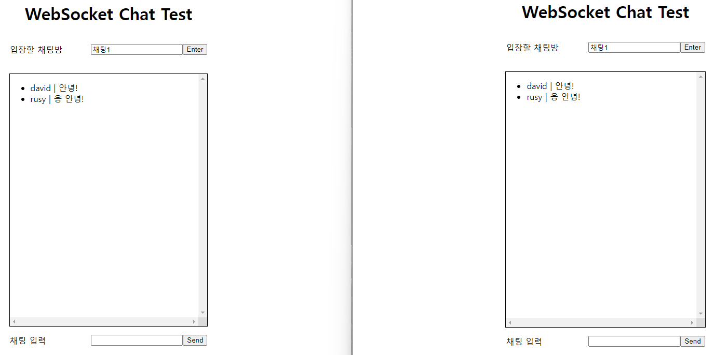
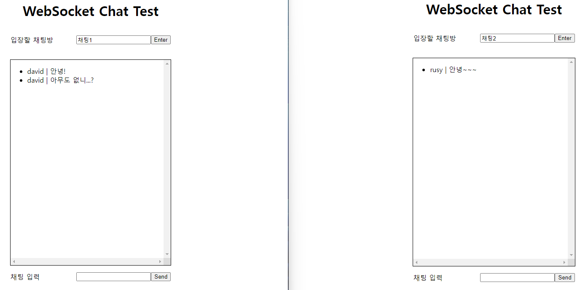

# FastAPI와 python-socketio를 활용한 채팅 프로그램
## 1. 개요
- 목표: FastAPI와 python-socketio를 사용하여 소켓 통신의 기본 프로세스를 익힌다.
- 프로그램 설명: 여러 클라이언트(브라우저 탭)가 FastAPI 서버와 소켓 통신하며 채팅을 주고 받는다.
- 특징: 각 채팅방을 socketio의 **room**으로 관리한다. 

## 2. 사용법
1. repo를 클론 받는다.
    ```
    git clone https://github.com/yudavid0611/socketio-test.git
    ```

2. 의존성을 설치한다.
    ```
    pip install -r requirements.txt
    ```

3. FastAPI 서버를 실행한다.
    ```
    uvicorn main:app --reload
    ```

4. 웹 브라우저에서 http://127.0.0.1:8000/chat?user={your_name}으로 접속한다. 
    - *{your_name}*: 채팅방에서 사용하고자 하는 이름을 적는다.
    - 예시: http://127.0.0.1:8000/chat?user=david

5. 웹 브라우저의 새로운 탭에서 4번 과정을 **다른 이름**으로 한 번 더 수행한다.
6. 브라우저에서 '입장할 채팅방'에 채팅방을 입력하고 Enter를 누른다.
7. 채팅을 입력한다.
8. 6-7번 과정을 채팅방을 바꾸어가며 수행해본다.

## 3. 결과
1. 두 클라이언트가 같은 채팅방(room)에 있는 경우


2. 두 클라이언트가 다른 채팅방(room)에 있는 경우


## 4. 참고 자료
- https://python-socketio.readthedocs.io/en/stable/index.html
- https://www.youtube.com/watch?v=_dlfzWzYeEM
- https://ctoahn.tistory.com/6
- https://dev-in-seoul.tistory.com/45
- https://medium.com/@parth116.rejoice/socket-io-with-python-fast-apis-1a1956b3989a